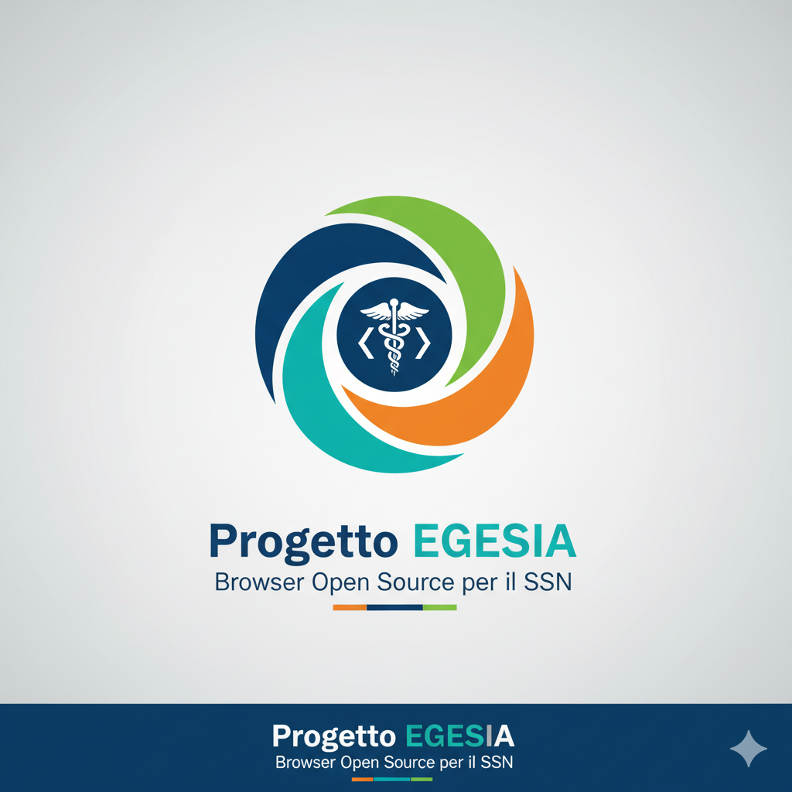

# 🛡️ Progetto EGESIA 

## Browser Open Source Dedicato agli operatori sanitari del Servizio Sanitario Nazionale (SSN)

Referente progetto: Marco Pingitore - E-mail: marco@marcopingitore.it

  
   
  <i>La piattaforma di navigazione sicura per l'operatore sanitario nel SSN.</i>

---

## Visione e Missione

Il progetto **EGESIA** mira alla progettazione e realizzazione di un **browser open source** concepito come un **punto di accesso unico e centralizzato** per tutti gli operatori e professionisti del Servizio Sanitario Nazionale (SSN) e dei Servizi Sanitari Regionali (SSR). Il nome "Egesia" evoca (da "Hegesias" in greco antico) l'idea di "guida" o "conduttore", riflettendo la nostra missione di guidare gli utenti attraverso la complessità del panorama sanitario digitale.

L'obiettivo è superare l'attuale frammentazione dei sistemi sanitari digitali , fornendo un'esperienza utente unificata, sicura e in tempo reale.

**EGESIA non è un semplice browser, ma un centro di controllo e un hub interoperabile**. Attraverso un'**unica login** (basata su SPID, CIE o credenziali professionali certificate con autenticazione a più fattori), l'utente potrà accedere in modo autorizzato a tutte le piattaforme digitali e ai dati clinici.

**Per il Cittadino, EGESIA si presenta come:**

1.  **Un'Applicazione Web Dedicata (usabile su qualsiasi browser esistente):** Il cittadino non dovrebbe scaricare un "nuovo browser" inteso come un'alternativa a Chrome. Invece, EGESIA sarebbe un **portale web avanzato** a cui si accede tramite l'URL (es. `https://egesia.salute.gov.it`). A quel punto, si autenticherebbe con SPID/CIE e utilizzerebbe le funzionalità offerte. Questo portale sarebbe progettato per funzionare in modo ottimale con i browser più diffusi (Chrome, Firefox, Safari, Edge). **Questa è la modalità più probabile e funzionale per il cittadino che usa un PC.**
2.  **Un'App Mobile Nativa per Smartphone e Tablet:** Per l'accesso da mobile, la soluzione più comoda ed efficace sarebbe proprio un'app scaricabile dagli store (Apple App Store, Google Play Store). L'app EGESIA fornirebbe un'esperienza ottimizzata per il touch, integrerebbe funzionalità del dispositivo (es. biometria per l'accesso rapido) e permetterebbe notifiche push, tutto ciò che rende l'esperienza mobile superiore a quella di un browser su smartphone. **Questa è la modalità più probabile e funzionale per il cittadino che usa uno smartphone/tablet.**

**Il "Browser" nel contesto di EGESIA (e il professionista sanitario):**

*   **Per il Professionista Sanitario (Desktop/Web):** Qui l'idea potrebbe essere duplice:
    1.  **Un'Applicazione Desktop Dedicata:** Costruita con framework come Electron o Tauri. Queste tecnologie permettono di creare applicazioni desktop che *utilizzano* tecnologie web (HTML, CSS, JavaScript) e spesso un motore di rendering web (come Chromium). L'utente scarica un'applicazione (come Slack o Spotify Desktop), ma al suo interno l'interfaccia è "web-based". Questo offre un ambiente più controllato e sicuro per il professionista, con possibili integrazioni a livello di sistema operativo non facilmente realizzabili in un normale browser web.
    2.  **Un Portale Web Avanzato:** Simile al cittadino, ma con funzionalità più complesse e dedicate. Questo è un approccio meno restrittivo e può essere più facile da implementare su vasta scala.

**In sintesi, per il cittadino:**

*   **PC/Desktop:** Accede a EGESIA tramite un **portale web dedicato** usando il suo browser preferito (Chrome, Firefox, ecc.).
*   **Smartphone/Tablet:** Scarica e utilizza l'**app mobile nativa EGESIA**.

Questo rende EGESIA estremamente accessibile e funzionale per il cittadino, superando la potenziale "scomodità" che giustamente hai sollevato.

**La visione rimane quella di un "Hub" unico, ma la sua "interfaccia" si adatta al contesto d'uso del cittadino (web o mobile app) e alle esigenze specifiche del professionista (applicazione desktop dedicata o portale web avanzato).**

---

**Fase 1: Analisi dei Requisiti e Obiettivi Strategici**

Prima di avviare lo sviluppo, sarà condotta un'analisi approfondita con tutti gli stakeholder del SSN (medici, infermieri, specialisti IT, amministrativi, pazienti, direzioni sanitarie, associazioni civiche). Gli obiettivi chiave includono:

*   **Sicurezza e Privacy:** Massima protezione dei dati sensibili dei pazienti, in conformità con GDPR e normative nazionali.
*   **Interoperabilità Universale e Nazionale:** Capacità di comunicare in modo fluido e standardizzato con tutti i sistemi informativi sanitari esistenti e futuri, con particolare enfasi sull'adesione al **"Realm Italiano" (https://www.hl7.it/realm-italiano/)** di HL7 Italia per FHIR.
*   **Usabilità Intuitiva e Personalizzata:** Interfacce utente progettate per essere chiare, accessibili (conforme W3C) e facili da usare, differenziate per le esigenze del cittadino (anche su mobile) e del professionista.
*   **Funzionalità Sanitarie Specifiche:** Strumenti dedicati che rispondano direttamente alle esigenze di accesso ai servizi per il cittadino e alle esigenze cliniche, diagnostiche e amministrative per il professionista.
*   **Trasparenza e Flessibilità:** L'approccio open source garantirà auditabilità, personalizzazione e un'evoluzione collaborativa del software, favorendo la partecipazione della comunità.

**Fase 2: Architettura e Scelte Tecnologiche**

EGESIA sarà costruita su una base robusta e collaudata.

*   **Per il Browser Desktop/Web (Professionista e Cittadino):** Estensione di un progetto open source esistente (es. basato su Chromium o un framework come Electron/Tauri).
*   **Per l'App Mobile (Cittadino):** Sviluppo di app native o ibride (es. React Native, Flutter) per iOS e Android, che sfruttino le stesse API e logiche del browser, garantendo un'esperienza coerente e sicura.
*   **Motore di Rendering/Framework UI:** Adozione di un motore/framework consolidato e performante.
*   **Linguaggi:** C++ per il core (se applicabile), JavaScript/TypeScript per l'interfaccia utente e le funzionalità web/app, Python per script di integrazione e backend.
*   **Sicurezza:** Implementazione di crittografia end-to-end (TLS 1.3), supporto per autenticazione a due fattori (SPID, CIE, smart card, token professionali, biometrica mobile), gestione granulare dei permessi tramite profili utente e sandboxing dei processi.
*   **Interoperabilità FHIR:** Il cuore dell'interoperabilità sarà l'integrazione nativa con FHIR, con particolare attenzione ai profili e alle guide di implementazione definite nel Realm Italiano.

**Fase 3: Funzionalità Chiave Basate su FHIR per lo Scambio Dati in Tempo Reale**

EGESIA sarà un "orchestrazione layer" che sfrutta **HL7 FHIR (Fast Healthcare Interoperability Resources)** e i **profili specifici del Realm Italiano**, per aggregare e presentare dinamicamente dati e funzionalità da diverse fonti, agendo come un client FHIR intelligente. Le funzionalità saranno distinte per i due profili utente, ma con una base dati comune e interoperabile:

**A) Funzionalità per il Cittadino (Browser e App Mobile - Accesso con SPID/CIE):**

*   **Fascicolo Sanitario Elettronico (FSE):** Accesso diretto e consolidato al proprio storico clinico, referti, diagnosi, terapie, profilassi vaccinali, con ottimizzazione per la fruizione mobile.
*   **Prenotazione e Disdetta Appuntamenti:** Interfaccia unificata e user-friendly per il Servizio di Prenotazione Unificato (CUP) regionale/nazionale, con notifiche push per appuntamenti.
*   **Consultazione Referti:** Accesso semplificato ai propri referti di laboratorio e diagnostica per immagini, anche tramite notifica di disponibilità.
*   **Gestione Consenso:** Dichiarazione e gestione del consenso per il trattamento e la condivisione dei propri dati sanitari.
*   **Teleconsulti Paziente-Medico:** Partecipazione a videoconsulti programmati con il proprio medico o specialisti, direttamente dall'app.
*   **Pagamento Ticket:** Accesso semplificato ai sistemi di pagamento online.
*   **Promemoria e Notifiche:** Gestione di terapie, appuntamenti, scadenze mediche.

**B) Funzionalità per il Professionista Sanitario (Browser Desktop/Web - Accesso con Credenziali Professionali):**

*   **Dashboard e Gestione Paziente Unificata (FHIR-Driven):**
    *   Accesso rapido a funzioni e dati.
    *   La selezione di un paziente attiverà il recupero dinamico di tutte le informazioni rilevanti (Anagrafica - `Patient`, Allergie - `AllergyIntolerance`, Diagnosi - `Condition`, Osservazioni - `Observation`, Farmaci - `MedicationStatement`/`MedicationRequest`, Documenti Clinici - `DocumentReference`) da diversi server FHIR (CCE ospedaliero, medico di base, FSE regionale), interpretando e consolidando i dati secondo i profili italiani. Questi dati verranno aggregati e presentati in un'unica vista coerente.
*   **Gestione Appuntamenti e Calendari (FHIR `Appointment`, `Schedule`, `Slot`):**
    *   Interfaccia unificata per la visualizzazione dei calendari professionali e la gestione in tempo reale delle **Liste d'Attesa**, con possibilità di prenotare, modificare o cancellare appuntamenti su scala regionale, aderendo agli standard FHIR italiani.
*   **Gestione Referti e Documenti Clinici (FHIR `DiagnosticReport`, `DocumentReference`):**
    *   Visualizzazione, creazione, firma digitale e archiviazione sicura di referti diagnostici (es. da Laboratori di Analisi) e altri documenti clinici, collegandoli a sistemi esterni e fornendo accesso diretto ai dati di **Diagnostica per Immagini** (tramite integrazione DICOM o riferimenti FHIR), sempre in conformità con il Realm Italiano.
*   **Prescrizioni Farmaceutiche Elettroniche (FHIR `MedicationRequest`, `MedicationDispense`):**
    *   Strumenti per la creazione, invio e gestione di prescrizioni elettroniche conformi a FHIR e alle specifiche italiane, inclusa la tracciabilità delle dispensazioni farmaceutiche da **Farmacie**.
*   **Telemedicina e Monitoraggio Remoto (FHIR `Observation`, `Communication`):**
    *   Funzionalità integrate per **videoconsulti sicuri** e condivisione di dati. Integrazione con dispositivi IoT medici per la visualizzazione in tempo reale di parametri vitali (risorse `Observation`) e per il monitoraggio remoto dei pazienti, utilizzando profili FHIR interoperabili.
*   **Strumenti di Sviluppo e Debug FHIR:**
    *   **Validatore FHIR (Realm Italiano):** Per garantire la conformità delle risorse rispetto ai profili nazionali specifici.
    *   **Visualizzatore Risorse:** Per ispezionare i payload JSON/XML di FHIR.
    *   **FHIR Explorer:** Un pannello per inviare query a endpoint FHIR e analizzare le risposte.

**Fase 4: Sicurezza e Conformità Normativa**

La sicurezza sarà la priorità assoluta per entrambi i profili utente, con:

*   **Crittografia end-to-end** per tutte le comunicazioni e i dati, anche su mobile.
*   **Sandboxing** e isolamento dei processi.
*   **Aggiornamenti di sicurezza** automatici e robusti per browser e app.
*   **Conformità stringente al GDPR** e a tutte le normative sanitarie italiane, inclusi i requisiti per l'interoperabilità definita a livello nazionale.
*   **Audit Trail** dettagliato per tracciare tutte le operazioni.
*   Programmi di **Penetration Testing** e **Bug Bounty**.

**Fase 5: Sviluppo Collaborativo Open Source**

Il progetto sarà ospitato su piattaforme come GitHub/GitLab, con:

*   **Documentazione completa** per sviluppatori e utenti.
*   Un **modello di governance** per indirizzare lo sviluppo e gestire i contributi.
*   **Incoraggiamento alla partecipazione** di sviluppatori, esperti di sicurezza e professionisti sanitari.

---

## 🤝 Come Contribuire

Siamo un progetto open source e accogliamo con entusiasmo contributi da sviluppatori, esperti di sicurezza, designer e professionisti sanitari. La tua esperienza è cruciale per il successo di **EGESIA**.

1.  **Dai un feedback:** Hai esperienza diretta nel SSN? Proponi funzionalità o segnala punti critici sui sistemi attuali aprendo una **Issue**.
2.  **Sviluppo:** Se sei esperto in **C++, Python, JavaScript/TypeScript** o integrazione **FHIR**, inizia a familiarizzare con i requisiti e guarda le Issue aperte etichettate con `good first issue` o `help wanted`.
3.  **Documentazione:** Aiuta a migliorare i file `README.md` e `CONTRIBUTING.md`.

**Prima di iniziare a scrivere codice, consulta il file [CONTRIBUTING.md](CONTRIBUTING.md) per le linee guida di sviluppo e il flusso di lavoro (workflow).**

---

## ⚖️ Licenza

Questo progetto è rilasciato sotto la licenza **EUPL (European Union Public Licence) v1.2**.

Vedi il file [LICENSE.md](LICENSE.md) per i dettagli completi della licenza.
